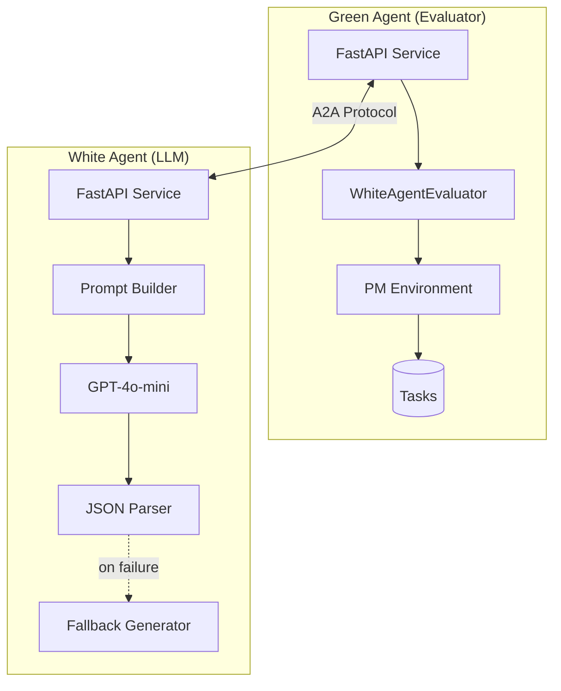
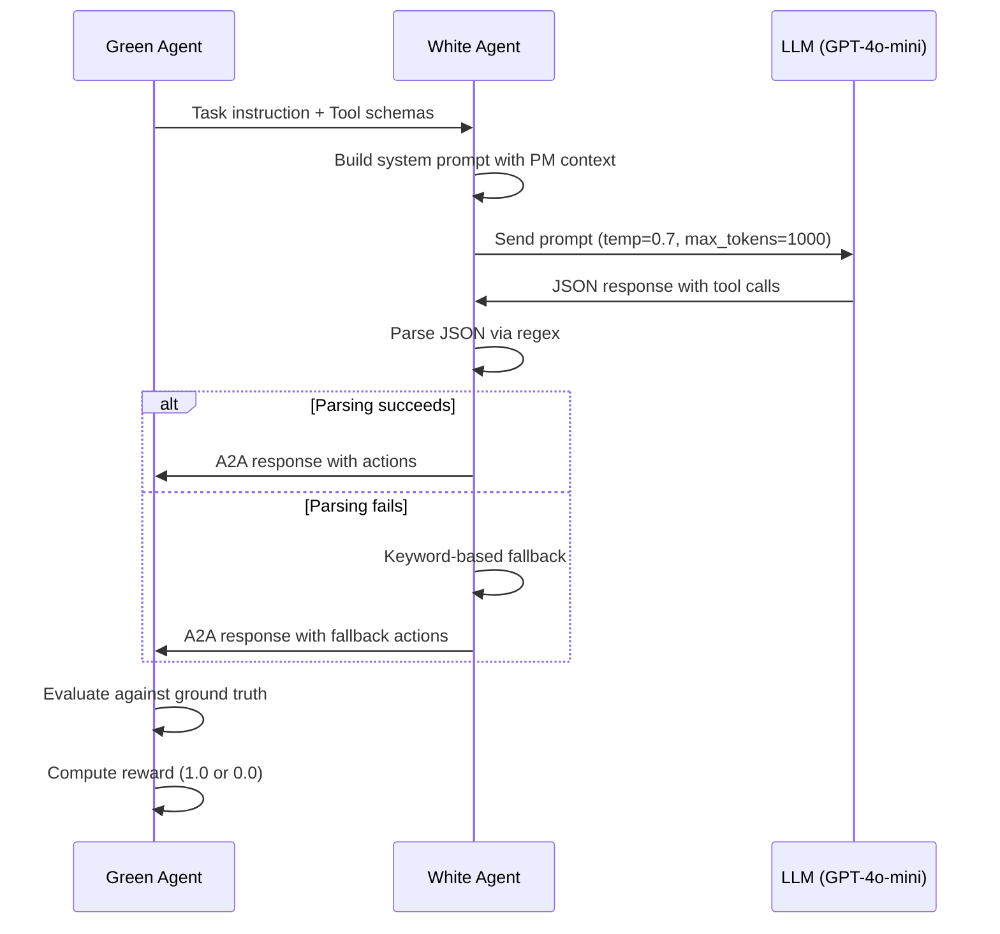
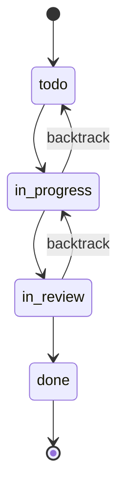
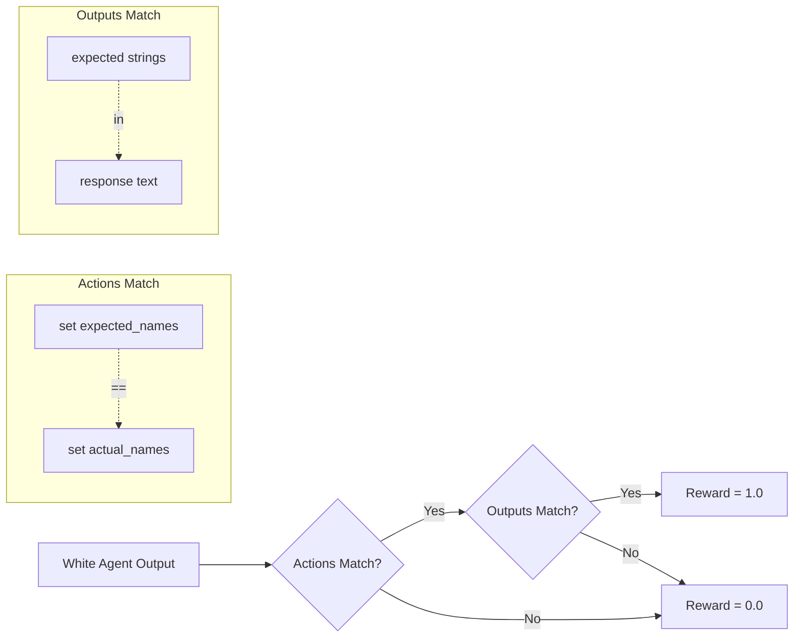

# LLM-Based White Agent for tau-Bench PM Domain

This repository contains an LLM-based white agent evaluated on the tau-Bench Project Management domain, implementing the A2A (Agent-to-Agent) protocol for tool-use evaluation.

## Architecture



## Decision Pipeline



## Quick Start

### Prerequisites

- Python 3.12+
- OpenAI API key

### Setup

```bash
# Clone and install
git clone <repo-url> && cd tau-bench
pip install -e .

# Configure API key
cp env.example .env
# Edit .env: OPENAI_API_KEY=your-key
```

### Run Assessment

```bash
# Option 1: Use launcher (recommended)
python launcher.py

# Option 2: Manual start
# Terminal 1: Green agent
python -m uvicorn service.green_agent.main:app --port 8000

# Terminal 2: White agent
python -m service.white_agent.main

# Terminal 3: Run tests
python test_integration.py
```

## PM Domain

### Data Model

| Entity | Count | Description |
|--------|-------|-------------|
| Users | 5 | Alice, Bob, Carol, David, Emma |
| Projects | 3 | Web App Redesign, Mobile Companion, Backend API |
| Tickets | 5 | Tasks with status, priority, assignee |

### Tools (9 total)

| Tool | Description |
|------|-------------|
| `list_tickets` | Query tickets with optional filters |
| `create_ticket` | Create new ticket with title, priority |
| `update_status` | Change ticket status |
| `assign_user` | Assign ticket to project member |
| `update_priority` | Change ticket priority |
| `add_comment` | Add comment to ticket |
| `get_user_details` | Retrieve user information |
| `transfer_to_human_agents` | Escalate to human |
| `think` | Internal reasoning step |

### Status Workflow



### Policy Rules

1. **Authentication**: Identify user at conversation start
2. **Single Project**: Work within one project per conversation
3. **Membership**: Only assign tickets to project members
4. **Confirmation**: Request confirmation before state changes
5. **One Action per Turn**: Either tool call or response, not both

## Evaluation

### Tasks

| Task | Actions | Description |
|------|---------|-------------|
| 0 | 4 | Assign high-priority tickets + update status |
| 1 | 2 | Create two tickets with different priorities |
| 2 | 1 | Update ticket status to in_review |
| 3 | 2 | Assign ticket + change priority |
| 4 | 2 | Add comment + mark done |

### Metrics



- **pass^1**: Fraction of tasks with reward=1.0 on single trial
- **actions_match**: `set(expected_action_names) == set(actual_action_names)`
- **outputs_match**: Expected strings appear in response text

### Results

| Agent | pass^1 | Tasks Passed |
|-------|--------|--------------|
| Keyword baseline | 20% | 1/5 (Task 2) |
| GPT-4o-mini | 40% | 2/5 (Tasks 1, 2) |

## White Agent Implementation

### System Prompt Structure

```
Domain Context
├── PM system description (users, projects, tickets)
├── Workflow rules (status transitions)
└── 5 policy constraints

Tool Catalog
├── Tool name and description
└── Parameters with types and requirements

Few-shot Examples
├── Example 1: List tickets
├── Example 2: Create and assign
└── Example 3: Update status

Response Format
└── JSON array of tool calls
```

### Modules

| Module | Function | Location |
|--------|----------|----------|
| Prompt Builder | Constructs system prompt | `_build_system_prompt()` |
| Tool Formatter | Converts JSON schemas to text | `_format_tools()` |
| LLM Caller | Async LiteLLM wrapper | `execute_task()` |
| JSON Parser | Regex extraction from output | `_parse_tool_calls()` |
| Fallback Generator | Keyword-based action mapping | `_generate_fallback_actions()` |

## A2A Protocol

### Endpoints

**Green Agent (port 8000)**
| Endpoint | Method | Purpose |
|----------|--------|---------|
| `/health` | GET | Health check |
| `/.well-known/agent-card.json` | GET | Agent discovery |
| `/a2a/register_agent` | POST | Register white agent |
| `/a2a/execute_task` | POST | Execute task |
| `/a2a/result/{id}` | GET | Get assessment result |

**White Agent (port 8002)**
| Endpoint | Method | Purpose |
|----------|--------|---------|
| `/health` | GET | Health check |
| `/a2a/agent-card` | GET | Agent capabilities |
| `/a2a/reset` | POST | Reset agent state |
| `/a2a/execute_task` | POST | Execute task |

## File Structure

```
tau-bench/
├── service/
│   ├── green_agent/
│   │   ├── main.py                 # FastAPI evaluator service
│   │   ├── white_agent_client.py   # A2A client + evaluator
│   │   ├── a2a_schemas.py          # Protocol schemas
│   │   └── config.py               # Configuration
│   └── white_agent/
│       ├── main.py                 # FastAPI LLM service
│       └── llm_agent.py            # LLMWhiteAgent class
├── tau_bench/
│   └── envs/
│       └── pm/
│           ├── data/               # JSON fixtures
│           ├── tools/              # Tool implementations
│           ├── tasks_test.py       # Test tasks
│           ├── wiki.md             # Policy documentation
│           └── rules.py            # Rule definitions
├── launcher.py                     # End-to-end assessment runner
├── env.example                     # Environment template
└── README.md                       # This file
```

## Configuration

### Environment Variables

```bash
OPENAI_API_KEY=your-api-key        # Required
LLM_MODEL=gpt-4o-mini              # Optional (default: gpt-4o-mini)
USE_MOCK_WHITE_AGENT=false         # Optional (default: false)
```

## References

- [tau-Bench Paper](https://arxiv.org/abs/2406.12045) - Yao et al., 2024
- [tau-Bench Repository](https://github.com/sierra-research/tau-bench)
- [AgentBeats Platform](https://v2.agentbeats.org)
